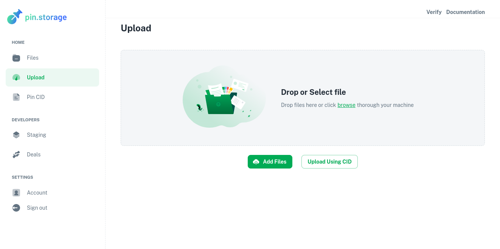
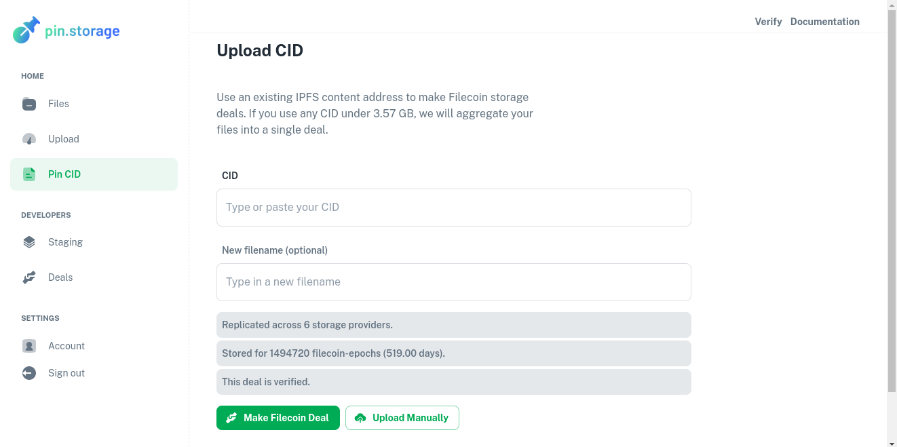

# Quickstart Guide

We're excited to have you try out Pin.Storage! Pin.Storage is a reliable way to upload public data onto [Filecoin](https://filecoin.io) and pin it to [IPFS](https://ipfs.io/).

For more information on what Pin.Storage is, visit our [home page](https://pin.storage/). If you are a developer looking to use Pin.Storage, continue through this quickstart guide.

Questions? Visit the [FAQ](/docs/FAQ).

# Get an API key

As a developer you have probably used API keys before. Pin.Storage provides a unique identifier used to authenticate a user, developer, or calling program to an application programming interface we have created.

If you don't know what an API key is, this tutorial will be challenging for you, but you can reach out to us if you're stuck. API keys are the standard way to authenticate a project with an API rather than a human user. **It is also important you understand how to protect your API key/secrets from bad actors and abuse**. If this concept is foreign to you, you might be better off just using [https://pin.storage/](https://pin.storage/) and storing data through our website.

### Getting started

Before we start, make sure you have done the following:

- **Create an account on https://pin.storage**. If you have not done this, you won't be able to get an API key for yourself. To create an account you can request access [here](https://docs.pin.storage/get-invite-key).

- **Setup an example application**. To use the API in a meaningful way, you should setup a sample application. You can use our [next-sass (React + NextJS)](https://github.com/application-research/next-sass) GitHub template, our [origin (Vue + Vite)](https://github.com/application-research/origin) template, or anything of your own choosing.

- **Have experience running code on your machine**. You're going to have a really hard time with this tutorial if you've never run code on your computer.

If you're ready, let's begin!

### Sign in to Pin.Storage

When you sign in to Pin.Storage, you should should land on this page.

Click on API keys.

### Generate an API key

On this screen you should see a button to generate an API key, click it.

### Test your API key

Use your new API key on the screen to the right by clicking the Authorize button and pasting in your Api Key.

** HOWEVER ** please note that the Authorize button sets the HTTP Authorization Header and to properly use the Pin.Storage API you should enter a value for the header in the format Bearer ESTxxxxxxxx-xxxx-xxxx-xxxx-xxxxxxxxxxxxARY

### What is next?

Now you are ready for the next part, [uploading your first file.](/Learn/Quickstart/Upload%20Your%20First%20File)
